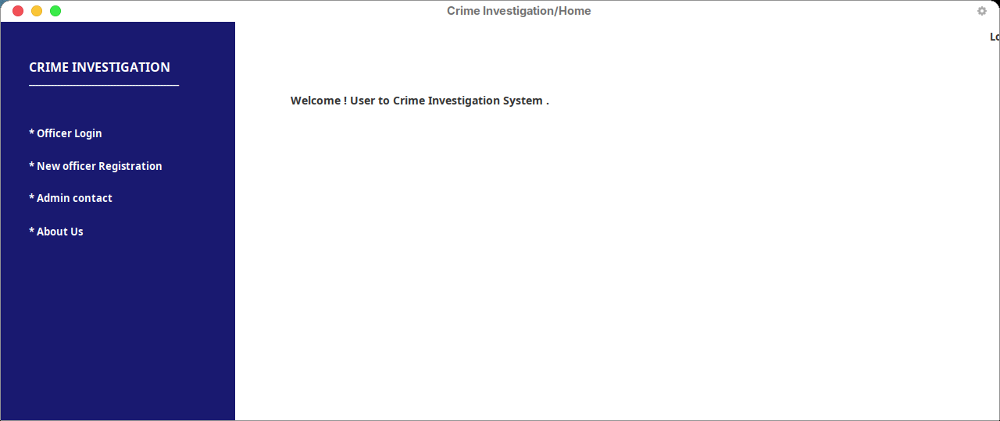
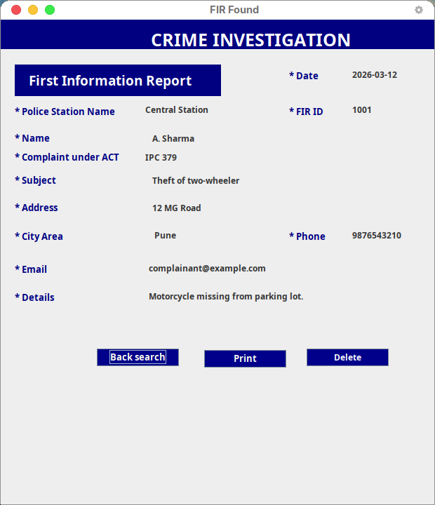
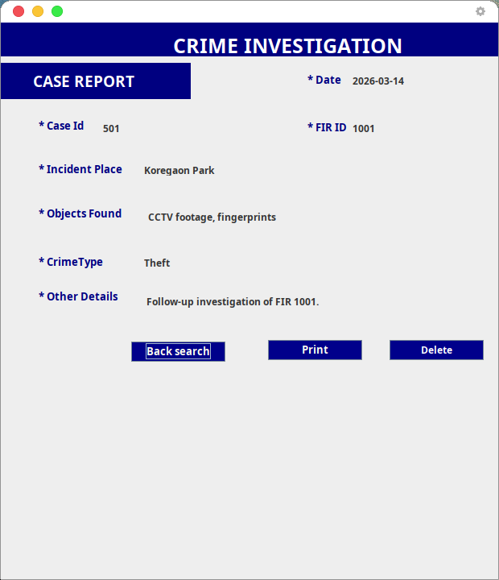
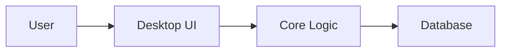

# Crime Investigation System

[](https://www.java.com/)
[](https://www.mysql.com/)
[](https://docs.oracle.com/javase/tutorial/uiswing/)
[](https://github.com/mangeshraut712/Crime-Investigation-System)

Desktop Java application for managing police officers, FIRs, cases, and criminal records, with MySQL persistence.

## Features

- **Police Officer Management**: Register and manage police officers.
- **FIR Management**: Create, search, and delete FIRs.
- **Case Management**: Create, search, and delete cases.
- **Criminal Management**: Add, search, and delete criminal records.
- **Admin Contact**: Provide feedback or suggestions to the admin.
- **About Us**: Information about the system.

## Screenshots

Captured from the Swing UI in 2026 (Home does not require MySQL; FIR and Case record views are the existing display screens populated from sample investigation fields).

### Home



### FIR record



### Case report



## Project Structure

```
.
├── Crime-Investigation-System/   # Eclipse/Java sources (UI, DB)
├── Database/
│   └── crimeinvestigations.sql   # MySQL schema
├── Jar File/
│   └── mysql-connector-java-8.0.11.jar
├── docs/screenshots/             # UI captures
└── README.md
```

## Prerequisites

- **Java Development Kit (JDK)**: Version 8 or higher.
- **MySQL Database**: Ensure MySQL is installed and running.
- **Eclipse IDE** (optional): For development and debugging.
- **MySQL Connector JAR**: Included in the `Jar File` directory.

## Setup Instructions

1. **Clone the Repository**:
   ```bash
   git clone https://github.com/mangeshraut712/Crime-Investigation-System.git
   cd Crime-Investigation-System
   ```

2. **Import the Project**:
   - Open Eclipse or your preferred IDE.
   - Import `Crime-Investigation-System/` as an existing Java project.

3. **Set Up the Database**:
   - Open MySQL Workbench or any MySQL client.
   - Execute the SQL script located at `Database/crimeinvestigations.sql` to create the database and tables.

4. **Configure Database Connection**:
   - Update the database connection details in `Crime-Investigation-System/src/DB/CrimeDB_Functions.java`:
     ```java
     con = DriverManager.getConnection("jdbc:mysql://localhost:3306/CrimeInvestigations?useSSL=false", "root", "root");
     ```

5. **Run the Application**:
   - Run the `Home` class from the `src/UI` package to start the application.

## Technologies Used

- **Java**: Core programming language.
- **Swing**: For building the graphical user interface.
- **MySQL**: For database management.
- **JDBC**: For database connectivity.

---

<!-- codex:project-diagram:start -->

## Project Diagram



_Desktop application structure from interface to persistence layer._

<!-- codex:project-diagram:end -->

## Contributing

Contributions are welcome! Please follow these steps:

1. Fork the repository.
2. Create a new branch for your feature or bug fix.
3. Commit your changes and push them to your fork.
4. Submit a pull request.

## License

This project is licensed under the MIT License. See the `LICENSE` file for details.

## Contact

For queries or feedback, use the **Admin Contact** screen in the application.
